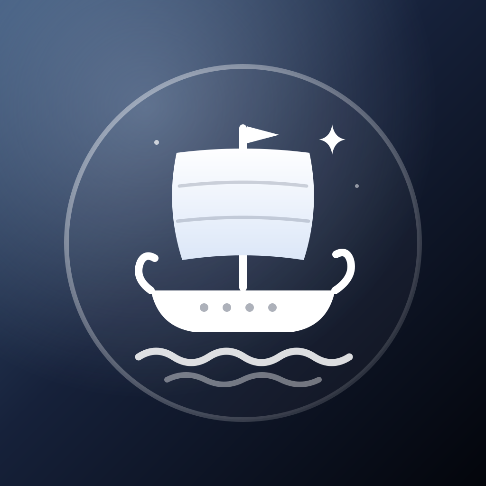

<p align="center"></p>

# Odysseus

**An on-device app store and signer for iOS.**

Odysseus combines every app from your sources into one App Store-style catalog, signs apps on your device with your own certificate or your own Apple ID, and installs them. It is based on [Feather](https://github.com/khcrysalis/Feather) by Samara and [FreeSign](https://github.com/FrizzleM/FreeSign) by Frizzle.

Requires iOS 17 or later, for liquid glass you need iOS 26.

## Features

- **Discover**: featured carousel, New & Updated, Recently Added, a row per source, categories (from the AltStore `category` field) and search. An app offered by several sources is shown once, "available from N sources", and you pick which source to get it from.
- **One-tap Get**: download → sign → install.
- **Sources**: AltStore sources (ESign sources work too). Add by URL or QR code, import and export your list.
- **Library**: Signed, Downloaded and Imported apps with expiry pills, plus your certificate's live revocation status.
- **Your own Apple ID**: sign in, and Odysseus makes its own development certificate on your Apple ID (the private key is made on the device), registers this device and an App ID per app, and signs with a 7-day profile. You can export the certificate as a password-protected `.p12` (after a warning and Face ID).
- **Real OCSP revocation checks**: asks Apple's responder about each certificate and checks the responder's signature. States: Valid, Revoked (date and reason), Unknown, Couldn't check. Re-checks both ways, Check Now, notifications on change, and warn / block / allow when signing with a revoked certificate.
- **Installing**: local server (`itms-services`) or pairing file + LocalDevVPN.
- **Tweaks** and app customisation from Feather.
- **Settings**: default signing identity, bundle ID prefix/suffix, revocation check frequency, expiry reminders, source auto-refresh, combine duplicates, Discover row order and hidden sources, custom plist server, delete IPA after signing, theme and accent presets, clear cache, diagnostics and log export.


## Building

GitHub Actions builds an unsigned `Odysseus.ipa` on every push (`.github/workflows/build.yml`). Pushes to `master` update the **nightly** prerelease on the Releases page; pushing a tag like `v1.0.0` publishes a normal release.

Locally (macOS with Xcode 26):

```sh
git clone --recurse-submodules https://github.com/mirazbakis/Odysseus
cd Odysseus
make iphoneos   # → packages/Odysseus.ipa
```

The Xcode project and target are still called `Feather` internally; the product is Odysseus.

## License

Odysseus is free software under the **GPL-3.0** (see [LICENSE](LICENSE)), like Feather and FreeSign..

Apple ID signing uses **SideSign** from SideStore / Catalyst, vendored in [`SideSign/`](SideSign) under the **AGPL-3.0** ([SideSign/LICENSE](SideSign/LICENSE)), with its dependencies CodeSignKit, GSACryptoKit and AnisetteKit. GPL-3.0 section 13 allows combining with AGPL-3.0 code; the SideSign parts stay under the AGPL-3.0.

## Credits

- **mbakis**: Odysseus
- [Samara](https://github.com/khcrysalis): Feather, the original app
- [Frizzle](https://github.com/FrizzleM): FreeSign
- [SideStore](https://github.com/SideStore) and [Magesh K](https://github.com/mahee96): SideSign, CodeSignKit, AnisetteKit, GSACryptoKit
- [zsign](https://github.com/zhlynn/zsign): on-device signing
- [idevice](https://github.com/jkcoxson/idevice): installs over the pairing file
- [Vapor](https://github.com/vapor/vapor), [Nuke](https://github.com/kean/Nuke), [Zip](https://github.com/marmelroy/Zip), [SWCompression](https://github.com/tsolomko/SWCompression)
- [backloop.dev](https://backloop.dev/): localhost SSL for the local install server
- [plistserver](https://github.com/nekohaxx/plistserver): hosted at api.palera.in
- [LiveContainer](https://github.com/LiveContainer/LiveContainer): Mach-O fixes
- [Asspp](https://github.com/Lakr233/Asspp): server setup code
